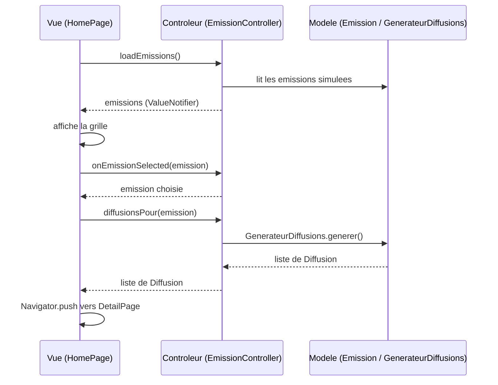

# Emissions en streaming - version MVC

Meme application que la version classique (grille d'emissions, page de detail avec transition
Hero, diffusions aleatoires) mais organisee selon le modele MVC.

## Repartition des responsabilites

### Modele (`lib/models/`)

- `emission.dart` : la classe `Emission` (id, nom, chaine, chemin de l'image). Juste des donnees.
- `diffusion.dart` : la classe `Diffusion` (jour, heure, minute) avec un peu de logique de
  formatage (`heureFormatee`, `libelle`).
- `generateur_diffusions.dart` : service qui genere une liste de diffusions aleatoires.

Ces trois fichiers n'importent jamais `flutter/material.dart`, il n'y a ni `BuildContext` ni
`setState` dedans. Ce sont des classes Dart normales, testables sans avoir besoin de lancer
l'application.

### Vue (`lib/views/`)

- `home_page.dart` : l'ecran principal (AppBar, BottomNavigationBar, grille d'emissions).
- `grille_emissions.dart` : affiche une `ResponsiveGridList` de `CarteEmission`.
- `carte_emission.dart` : une carte purement visuelle pour une emission.
- `detail_page.dart` : la page de detail, affiche une `Emission` et une liste de `Diffusion`
  qu'on lui donne - elle ne les genere jamais elle-meme.

Les vues ne font aucun calcul metier : `CarteEmission` et `GrilleEmissions` recoivent un callback
`onTap` et se contentent de l'appeler, sans savoir ce qu'il se passe derriere.

### Controleur (`lib/controllers/emission_controller.dart`)

`EmissionController` fait le lien entre le modele et la vue :

- `loadEmissions()` charge les emissions (ici simulees en dur) dans un `ValueNotifier`.
- `getEmissions()` renvoie la liste actuelle.
- `onEmissionSelected(emission)` prepare la navigation (elle renvoie simplement l'emission
  choisie, elle ne fait pas de `Navigator.push`).
- `diffusionsPour(emission)` demande au modele de generer les diffusions pour une emission.

Le controleur ne construit aucun widget. C'est `HomePage` qui, dans son `onTap`, appelle le
controleur puis fait elle-meme le `Navigator.push` vers `DetailPage`.

## Schema des echanges entre les trois couches



## Lancer l'application

```bash
cd version_mvc
flutter pub get
flutter run
```

## Lancer les tests

```bash
flutter test
```

Il y a trois familles de tests dans `test/` :

- `test/models/` : tests purement Dart sur `Diffusion` et `GenerateurDiffusions`, sans binding
  Flutter.
- `test/controllers/` : tests sur `EmissionController` (chargement, selection, generation des
  diffusions).
- `test/widget_test.dart` : verifie que la page d'accueil s'affiche et que chaque emission ouvre
  bien sa propre page de detail (avec la bonne image).
